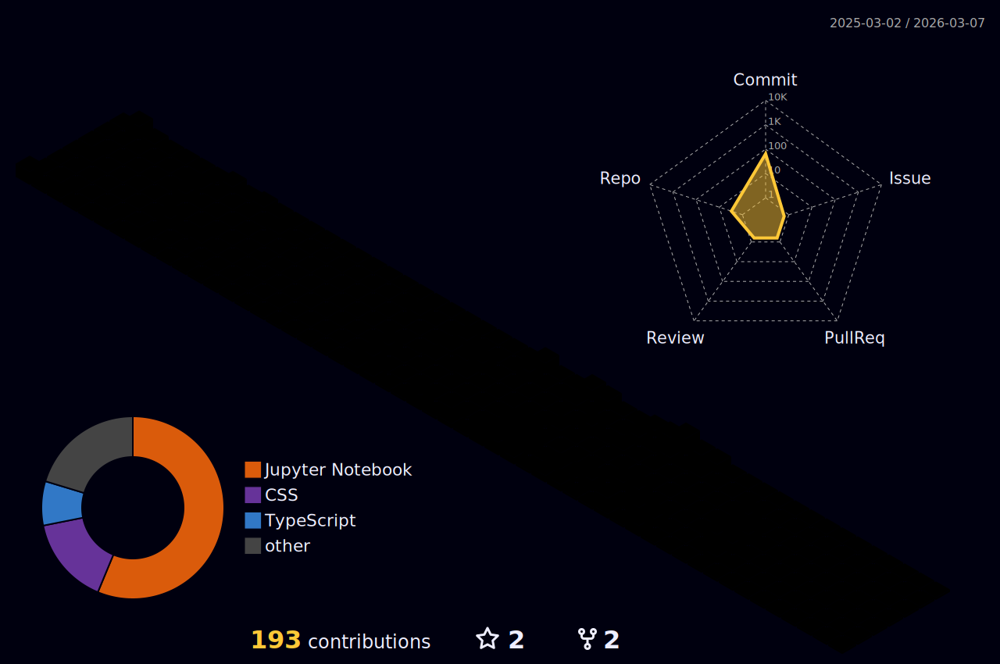

  

<h1 align="center">Hi , I'm Kasidit "New" Boonpornpichet</h1>
<h3 align="center">⚙️Computer Engineer | ✨Math & Data Science Enthusiast | 🎨Generative Art</h3>

 
 

  <em>
    A <b>third year</b> <a href="https://www.cpe.kmutt.ac.th/en/"><b>Computer Engineering</b></a> undergraduate from <a href="https://www.kmutt.ac.th/en"><b>King Mongkut's University of Technology Thonburi (KMUTT)</b></a>, Thailand.  
    Obsessed with the beauty of <b>Mathematics</b> and <b>Algorithms</b>, enjoy creating <b>Generative and Procedural Arts</b>,  
    currently interested in (studying) <b>Data Science</b>, <b>Machine Learning</b>, <b>Computer Graphics</b>, and <b>CAGD</b> 
  </em> 
   

 

<!-- 
&nbsp;<em><strong>Talking about Personal Stuffs…</strong></em>

✔ Pronouns: <em><strong>He/His</strong></em> or <em><strong>TeamMaker</strong></em>😉  
✔ I’m currently Developing <strong>Paycron</strong> Payment Gateway <strong>@Plaxonic</strong> 
✔ I’m currently learning <strong>ReactJS</strong> &amp; <strong>NodeJS</strong> 
✔ I’m looking to collaborate with any <strong>Open - Source contribution</strong> 
✔ I’m looking for help for learning <strong>Remote Sensing</strong> 
✔ I regularly write articles on <a href="https://auth.geeksforgeeks.org/user/akash_chowrasia/articles">GeeksforGeeks</a>  
✔ I use to write coad on <a href="https://leetcode.com/Akash_Chowrasia/">leetcode</a>  
✔ Ask me about anything, I am happy to help, only if the ball is in my court!😉 
✔ Fun fact : <em>At The time of Stress coding, I use to be in half sleeping mode</em>    
 -->

&nbsp;<em><strong>Languages I Know…</strong></em>

        <code></code>
        <code></code>
        <code></code>
        <code></code>
        <code></code>
        <code></code>
        <code></code>
        <code></code>

&nbsp;<em><strong>Tools I Use…</strong></em>

        <code></code>
        <code></code>
        <code></code>
        <code></code>
        <code></code>
          
        <code></code>
        <code></code>
        <code></code>
        <code></code>
        <code></code>

  &nbsp;
  <i><b>< GitHub Stats ></b></i> &nbsp;
  

  

&nbsp;
  

  

<a href="https://cultofthepartyparrot.com">Party Parrot</a>:

    
    
    
    
    
    
    
    
    
    
    
    
    
    
    
    
    
    
    
    
    
    
    
    
    

README Template Credits: <a href="https://github.com/Akash-chowrasia">Akash chowrasia</a>

Last Edited on: 28/09/2025

